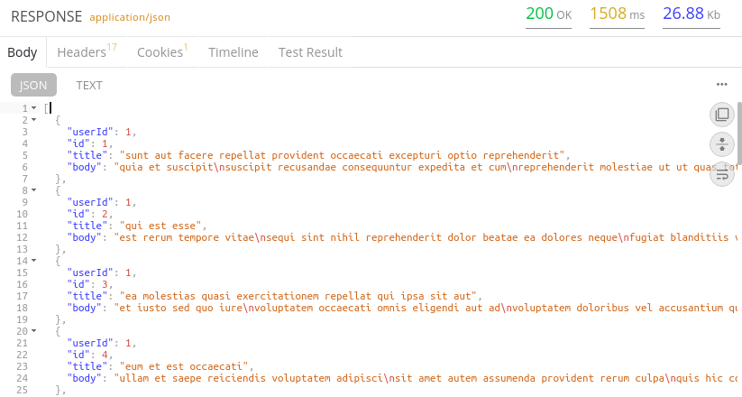
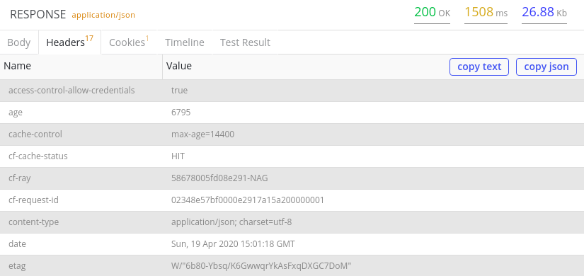
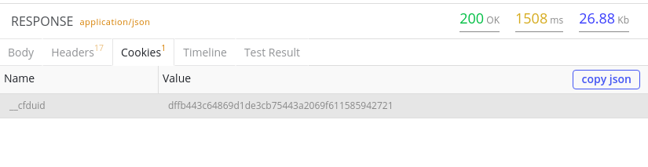
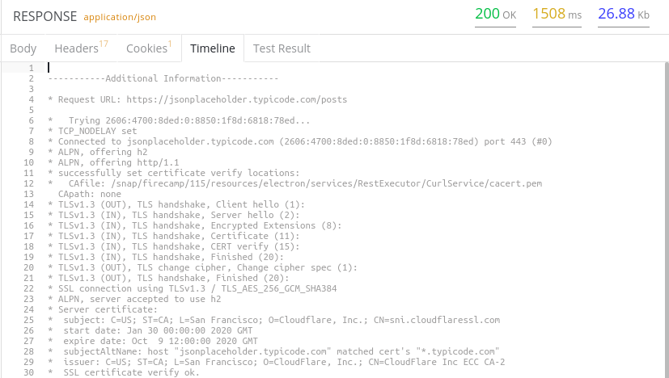

import { Link } from 'gatsby';

## Prerequisites

- Request should be sent successfully

## Directions

1. Once you're done sending a request succesfully, observe the results in the Response Panel.
2. The Body tab in the Response Panel displays the results returned by the server in response to your request.
 
_Respone Panel Body tab_
3. The Headers tab beside it shows the details about the response, like content-type, cache control, server name, date and time of the response, etc.
 
_Header tab_
4. Additionally, you can check for the cookies in the Cookies tab.
 
_Cookies tab_
5. Another important tab is the Timeline tab that describes the data and gives additional information about the request and the response.
 
_Timeline tab_

<!--## Short descriptive GIF (w ALT text)-->

## Additional resources
- <Link to=""../impressions/response-panel">Impression: Response Panel</Link>
