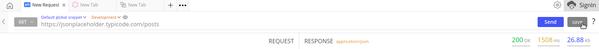
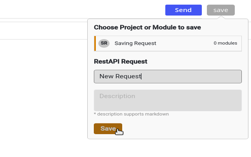

import { Link } from 'gatsby';

## Prerequisites

- Request should be sent

## Directions

1. Once you're done entering a payload inside your Request Panel and sending the request to the server, observe the response and navigate to the Save button in the top right corner of the window.
 
_*Save Button on URL Bar*_
2. Click the Save button.
3. Enter the title and description of the request.
4. Choose a project or a module you wish to save your request to.
 
_*Saving a request to a pre-created Project*_
5. Hit Save.

There you go! You can now manage and modify your saved requests later.

<!--## Short descriptive GIF (w ALT text)-->

## Additional resources
- <Link to="./sending-your-first-request">Action: Sending your first request</Link>
