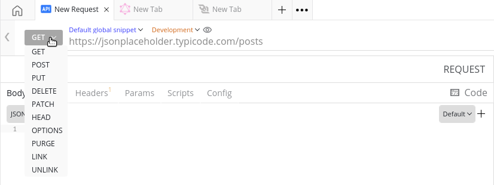
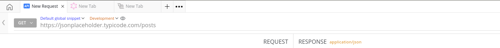
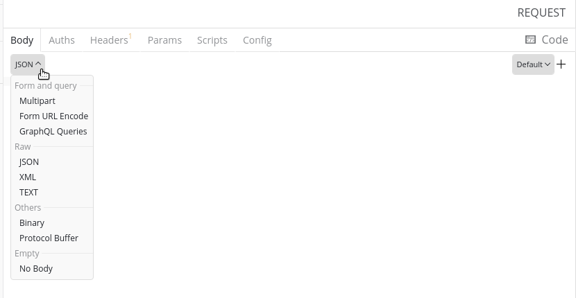
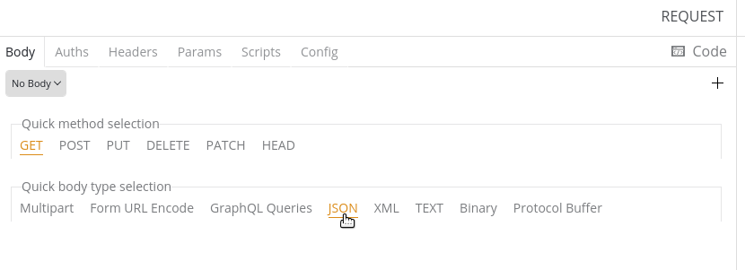

## Prerequisites

- Environment snippet should be set

## Directions

1. Select the Request Method from either the drop down menu or the Quick Method Selection section.
 
_Request Selection drop down menu_

2. Set the API end-point in the URL bar.
 
_Setting the end-point in the URL Bar_

3. Select a body type from from either the drop down menu or the Quick Body Type Selection section.
 
_Body type selection drop down menu_
 
_Quick body and request type selection_

4. Input an API payload in the content-type format inside the Request Panel.
5. Hit enter and observe the response.

## Additional information:

<!-- Include the commented section below in the Body Type Selector Impression.
When you're testing an API and want a quick response, you would want to create multiple bodies with different body types to facilitate a quick testing process. Firecamp has you covered. -->

To test out APIs smoothly and to facilitate a quick response, create multiple bodies as instructed below:

1. Navigate to the tiny `+` icon in the top right corner of the Request Panel and click on it.
2. Enter a name for your body in the name field with the placeholder `New Body Name` and hit enter.
3. You can either create a new body or copy the current body by checking the checkbox below the name field.
4. Test you the API using different bodies smoothly.

Voila! Now you know how to send your first request.

<!--## Short descriptive GIF (w ALT text)-->

## Additional resources
- [Request Mehtods](https://developer.mozilla.org/en-US/docs/Web/HTTP/Methods)
